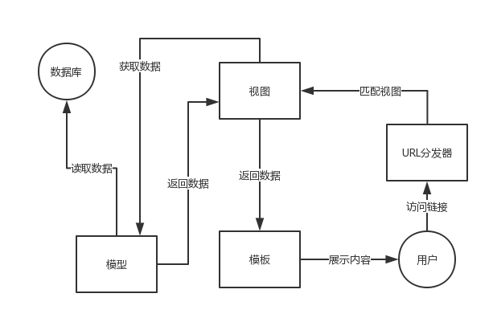

### Django 框架的核心包括：

* 面向对象的关系映射模型，支持编写对应数据表的映射类，这一点做得格外优秀
* URL 分发器，基于正则表达式（Django2 中支持 path 编写简洁路径字段）
* 视图系统，用于接收客户端请求和返回响应
* 模板系统，内置 Jinja2 模板引擎，便于编写 Python 风格的动态数据处理代码
* 轻量、独立的 Web 服务器，便于开发测试
* 缓存框架，支持多种缓存方式
* 中间件，对请求处理阶段进行额外操作

### MTV模型

Django 的这种结构我们称之为 MTV 模式：M 代表模型（Model），T 代表模板（Template），V 代表视图（View）。
这三个分别代表了三种不同功能的 Web 应用，各司其职，又彼此合作。
案例分 3 个 Python 文件（models.py，urls.py，views.py）和 HTML 模板文件（template.html）。

创建项目及App
```
django-admin startproject myProject
cd myProject
python3 manage.py startapp myAp
```


```
manage.py 项目的入口文件，在后面的实验中我们会大量使用它来执行一些命令用来创建应用、启动项目、控制数据表迁移等
myProject/settings.py 配置文件，里面包含对数据库的设置项、CSRF Token 的设置项、模板的设置项等全部设置。
myProject/urls.py 路由控制文件，处理客户端请求，分发到对应的视图函数去处理。
myProject/wsgi.py 处理请求和响应，我们很少去动它。

myApp/admin.py 用于控制后台管理的文件，在后面的实验中会用到。
myApp/apps.py 用于管理应用本身的文件，包括应用的名字如何命名，默认就是 myApp 。
myApp/__init__.py 空文件，前面已经介绍过。
myApp/migrations 这是用于记录数据库变更信息的目录，Django 中自带的数据库版本控制功能就体现在这个目录，在学习数据存储时会详细介绍。
myApp/models.py 创建映射类的文件，熟悉 Flask 的同学一定不陌生。
myApp/tests.py 编写测试代码的文件。
myApp/views.py 创建视图函数的文件，视图函数用于处理客户端发来的请求。
```
启动命令
```
cd myProject
python3 manage.py runserver 0:8080
```

### 数据模型

模型是真实数据的简明描述。它包含了存储的数据所必要的字段和行为。Django 遵循不要重复自己（DRY 原则）。
它的目标是让你只需要定义数据模型，然后其它的东西你都不用关心，都会自动从模型生成。
* 相关命令：
```
生成迁移文件：python manage.py makemigrations
生成后还需执行,迁移数据库： python manage.py migrate
用来把数据库迁移文件转换成数据库语言：python3 manage.py sqlmigrate myApp 0002
```
* 增删改查API:

```
Entry.objects.all()
Entry.objects.filter(id=1)
```

### 模板相关

* 默认的设置文件设置了 DjangoTemplates 后端，并设置 APP_DIRS = True。
这一选项将会让 DjangoTemplates 在每个 INSTALLED_APPS 文件夹中寻找 templates 子目录。

* render函数：载入模板，填充上下文，再返回由它生成的 HttpResponse 对象是一个非常常用的操作流程。
于是 Django 提供了一个快捷函数 render()。render() 函数把 request 对象作为它的第一个参数，模板作为第二个参数，字典作为它的可选的第三个参数。
它返回给定模板呈现的给定文本的一个 HttpResponse 对象。
    * request对象：当一个页面被请求时，django就会创建一个包含本次请求原信息的HttpRequest对象。django会将这个对象自动传递给响应的视图函数，一般视图函数约定俗成地使用request参数承接这个对象。

* 路由相关

1. reverse(viewname, urlconf=None, args=None, kwargs=None, current_app=None)[source] 利用viewname输出url完成重定向

```
 path('detail', views.detail_book, name='detail') name参数为viewname
 
 def add_book(request):
    if request.method != 'POST':
        return render(request, 'add.html')
    temp_name = request.POST['name']
    temp_author = request.POST['author']
    temp_pub_house = request.POST['pub_house']
    temp_book = Book(name=temp_name, author=temp_author, pub_house=temp_pub_house, pub_date=timezone.now())
    temp_book.save()
    return redirect(reverse('detail'))
```

2. path转换器

```
from django.urls import path  
from . import views  
urlpatterns = [  
    path('articles/2003/', views.special_case_2003),  
    path('articles/<int:year>/', views.year_archive),  
    path('articles/<int:year>/<int:month>/', views.month_archive),  
    path('articles/<int:year>/<int:month>/<slug>/', views.article_detail),  
]
```    

### MTV



在 MTV 模式中，MVC 中的 View 分成了视图 View（展现哪些数据）和模板 Template（如何展现）2 个部分，而控制器（Controller）这个要素由框架自己来实现了，我们需要做的就是把 URL 对应到视图 V 就可以了，通过这样的 URL 配置，系统将一个请求发送到一个合适的视图。

### CSRF

CSRF的本质在于攻击者欺骗用户去访问自己设置的地址，所以如果要求在访问敏感数据请求时，要求用户浏览器提供不保存在cookie中，并且攻击者无法伪造的数据作为校验，那么攻击者就无法再运行CSRF攻击。
这种数据通常是窗体中的一个数据项。服务器将其生成并附加在窗体中，其内容是一个伪随机数。当客户端通过窗体提交请求时，这个伪随机数也一并提交上去以供校验。正常的访问时，客户端浏览器能够正确得到并传回这个伪随机数，而通过CSRF传来的欺骗性攻击中，攻击者无从事先得知这个伪随机数的值，服务端就会因为校验token的值为空或者错误，拒绝这个可疑请求。

```
<form action="/add" method="post">
  <input type="hidden" name="csrfmiddlewaretoken" value="kK56Vip0W6QeMwX5NE65dp9hOmFObB1TiHNhFK6EgOI4eC5M1NePc8Wfw7NuupAG">
  <p><span>书名：</span><input type="text" name="name" /></p>
  <p><span>作者：</span><input type="text" name="author" /></p>
  <p><span>出版社：</span><input type="text" name="pub_house" /></p>
  <input type="submit" value="添加" />
</form>
```

### 关联链接

* 官方入门教程：https://docs.djangoproject.com/en/2.0/
* HttpRequest对象介绍：https://www.cnblogs.com/yang-wei/p/9997696.html